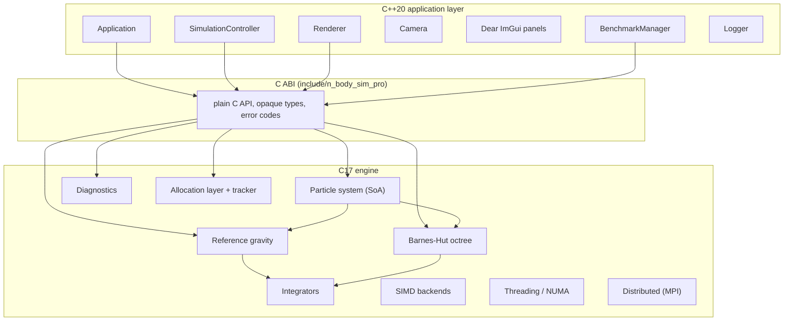
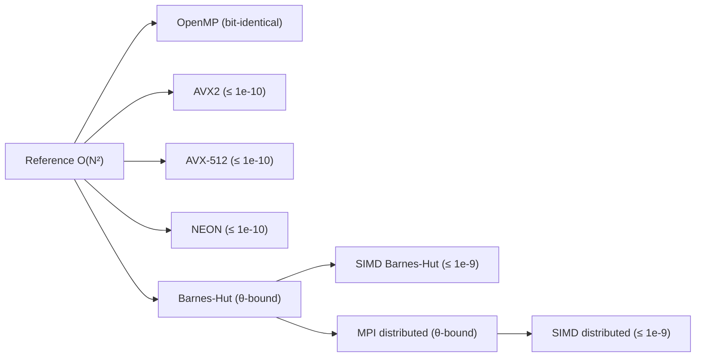

# Architecture

This page documents the *why* of every major decision, not just the *what*.
Each decision exists to serve a stated, measurable goal.



## C / C++ boundary

The engine is two layers joined by a plain C ABI.

- **C17** (`src/c/`, public headers in `include/n_body_sim_pro/`): numerical
  kernels, particle storage, Barnes-Hut, diagnostics, allocation, SIMD
  backends, threading, NUMA, MPI wrappers. Data-oriented, procedural,
  opaque types, explicit error codes, no global mutable state.
- **C++20** (`src/cpp/`): application, simulation controller, renderer,
  camera, UI, logging, benchmarking. Uses RAII, `std::unique_ptr`, `enum
  class`, exceptions at layer boundaries.

**Why**: the numerical kernels are validated and benchmarked against a
scalar reference; a plain C ABI keeps them decoupled from application
concerns and testable in isolation. The C++ layer can then be as expressive
as it needs to be without leaking into hot loops.

Every C function returns an `NBodySimProStatus` and can carry an `NBodySimProError`
with a message, source file, and line. The C++ wrappers translate failures
into exceptions at the boundary.

## Particle storage: Structure of Arrays

Particles live in ten contiguous `double` arrays (positions x/y/z,
velocities x/y/z, accelerations x/y/z, masses), each **64-byte aligned**.

| array | bytes/particle |
|-------|----------------|
| positions x/y/z | 24 |
| velocities x/y/z | 24 |
| accelerations x/y/z | 24 |
| masses | 8 |
| **total** | **80** |

**Why SoA:**

1. **SIMD**: kernels operate on one quantity at a time (all x positions,
   then all y...). SoA keeps each stream contiguous, so vector loads/stores
   stay dense and cache lines are fully used.
2. **Temporal locality**: different quantities change at different times
   during a timestep (forces accumulate into acceleration; integration reads
   position + velocity). Separating them avoids writing entire 80-byte
   particle structs when only one quantity changes.

The layout is documented and mirrored exactly by the memory estimator, so
the estimate is honest about what will be allocated.

## Reference first

`n_body_sim_pro_gravity_compute_acceleration_reference` is the deliberate O(N²)
single-threaded scalar correctness authority. It is never deleted and never
"fixed up" to be faster.

**Why**: every optimized kernel (OpenMP, SIMD, Barnes-Hut, distributed) is
validated against it. A wrong-but-fast kernel is useless; a readable slow
reference makes correctness testing straightforward and gives every
optimization a ground truth to be measured against.

The kernels form a strict validation chain:



## Barnes-Hut octree

The tree is a **contiguous node array with integer child indices**; no node
is individually heap-allocated. Leaf capacity is one particle. Children
always have higher indices than their parents, so a reverse-index pass is a
valid post-order traversal for center-of-mass accumulation.

Each node is 72 bytes: 8 child indices (int32), a particle index (leaf
marker), a particle count, center of mass (3 doubles), and total mass.

**Why**: pointer-heavy octrees fragment memory and destroy cache behavior at
10M particles. Integer indices keep the tree compact, relocatable, and
addressable with minimal metadata.

### Morton-order reordering

Particles are reordered by a 63-bit Morton (Z-order) key computed from
quantized positions, sorted with a 3-pass LSD radix sort, and the tree is
built and traversed in that order.

**Why**: spatially near particles share tree paths. Sorting by Z-order makes
both the build and the force traversal touch nodes sequentially instead of
at random, converting L3-cache misses into hits.

**Measured** (1M particles, 16 threads): step time dropped from **3.25 s** to
**1.39 s** —a 2.3× improvement with no change to the physics.

### Opening criterion

A cell with center of mass *C*, total mass *M*, side length *s* is
approximated when the query particle satisfies

$$
\frac{s}{d} < \theta
$$

where *d* is the distance from the particle to *C*. The criterion is
evaluated with squared quantities to avoid a square root per node:

$$
s^2 < \theta^2 d^2
$$

The essential property —every cell a traversal descends into has its
children present —is guaranteed because the same distance-to-COM criterion
drives both the traversal and (in the distributed case) the essential-tree
exchange.

## Runtime SIMD dispatch

At startup the engine detects CPU features (CPUID on x86, compile-time
architecture on ARM64) and selects the best backend **for which a real
kernel exists**. The selected backend is what is actually used and what the
UI reports.

```
AVX-512 + FMA available → AVX-512 kernel
AVX2 + FMA available     → AVX2 kernel
AArch64 (NEON)           → NEON kernel
otherwise                → scalar kernel
```

All-pairs and Barnes-Hut kernels now exist for AVX2, AVX-512, and NEON. CMake
defines `N_BODY_SIM_PRO_HAVE_*_KERNEL` only when the matching translation
unit is built with the ISA's flags, so a backend is never selected on a build
that lacks its kernel. The UI distinguishes "detected ISA" from "selected
backend" and never conflates them.

## OpenMP

The force kernels parallelize the outer particle loop with a static
schedule. The all-pairs OpenMP kernel keeps each particle's inner sum in the
same order, so it is **bit-identical** to the reference on a given machine —parallelism with zero numerical change. The Barnes-Hut traversal is
parallelized the same way over query particles; the tree is read-only during
evaluation, so no locking is needed.

Thread count is configurable at runtime and defaults to all available
threads. Nothing artificially limits it.

## Allocation and tracking

Internal allocations go through `n_body_sim_pro_allocate`/`n_body_sim_pro_deallocate`, which
attach a header carrying size, alignment, and a **category** (particles,
octree nodes, thread workspace, renderer, UI, ...). Third-party libraries
never use this layer and the process allocator is never replaced.

The allocation tracker buffers events in **thread-local staging** and
flushes them in batches under one lock, so the hot allocation path is a TLS
store plus one flag check. When disabled (default in release builds) it is a
single branch. Per-allocation `printf` would destroy benchmark validity; the
design deliberately avoids it.

## NUMA

The engine detects the NUMA topology (Windows `GetNuma*`, Linux sysfs), can
pin threads with Compact/Spread policies, and provides a first-touch helper.
Particle generation can run in parallel with OpenMP: each thread writes its
own slice of the SoA arrays, which is both parallel generation and NUMA
first-touch placement. On the single-node development machine NUMA reports
one node and placement is a harmless no-op; the code path is real.

## MPI distributed execution

When built with MPI, each rank owns a contiguous particle block. Every force
evaluation builds a local Morton-ordered tree, exchanges a **local essential
tree** level by level (`MPI_Allgatherv`, `MPI_Allreduce` termination), and
walks the local tree plus the remote essential forest. The traversal is
SIMD-accelerated: the exchange and tree build are byte-identical to the
scalar kernel, while the per-particle force accumulation is staged and
applied with vector FMA. See [Distributed (MPI)](/distributed) for the full
protocol and correctness argument.

## Renderer

Physics never depends on OpenGL. The controller owns the particle system;
the renderer uploads a snapshot of positions each frame and draws them as
`GL_POINTS` plus line strips. Rendering never mutates simulation state, and
the headless tools never initialize SDL at all.

## Instrumentation

The engine separates instrumentation from measurement:

- A structured **logger** with severity, category, thread id, and a bounded
  ring buffer rendered in the developer console. Never called from hot
  loops.
- **Phase telemetry**: the Barnes-Hut kernel measures tree build and
  evaluation time internally; the controller measures full step time. All UI
  values come from these real timers.
- **Conservation diagnostics** (momentum error, center-of-mass offset,
  energy drift) computed from actual particle state. Energy drift requires
  the O(N²) potential sum, so it is tracked only for systems small enough
  to afford it; larger systems render `N/A`.
