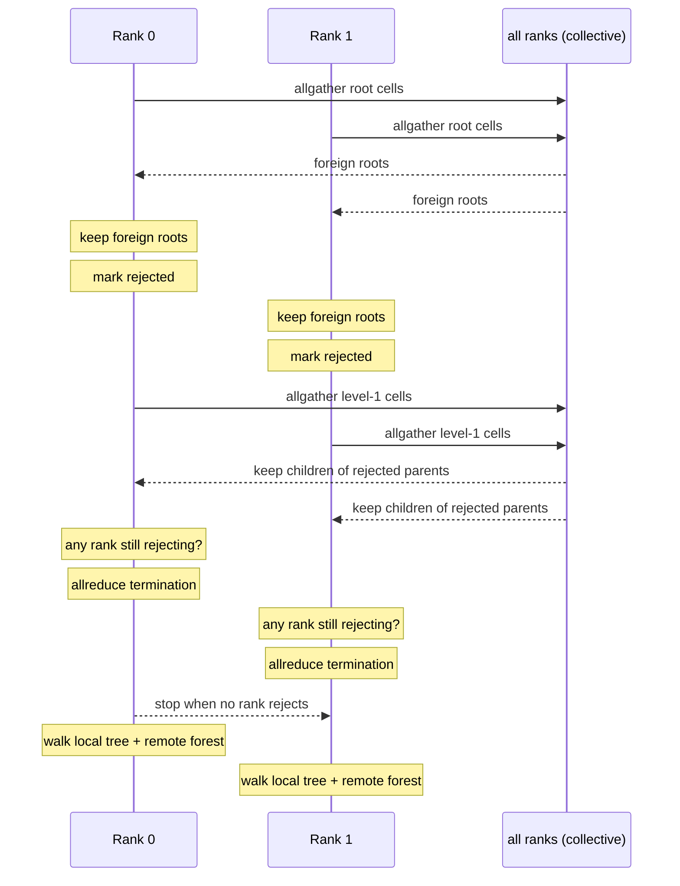

# Distributed (MPI)

The engine can run across MPI ranks with a **local essential tree**
exchange. Every rank holds a distinct contiguous particle block and real
messages move tree cells — this is not a simulated single-process
"distributed" mode.



## Partitioning

The global particle count is divided into contiguous blocks, one per rank.
Each rank generates and owns its block, and computes forces **only for the
particles it owns**. There is no particle migration in this version; each
block stays on its rank.

## The essential-tree exchange

Per force evaluation, each rank:

1. **Builds a local Morton-ordered tree** over its own particles.
2. Exchanges tree cells level by level:
   - **level 0**: every rank broadcasts its root cell; every rank keeps every
     foreign root.
   - **level L**: a rank keeps a foreign cell when it is the child of a
     foreign cell that rank rejected (needed finer detail) at level L−1, and
     requests the next level for cells it rejects now.
   - **stop**: when no rank rejects any cell (`MPI_Allreduce`), the remote
     essential forest is complete.
3. **Assembles the remote cells** into a compact octree with the same node
   layout as the local tree (remote leaves marked `particle_index == -2`).
4. **Walks the local tree and the remote forest** (reset traversal stacks),
   writing accelerations for this rank's particles. The per-particle force
   accumulation is SIMD-accelerated when the machine supports it — the
   exchange and the tree build are byte-identical to the scalar kernel, and
   only the force sum is staged and applied with vector FMA (see
   [SIMD](/simd)).

The protocol moves cells with `MPI_Allgatherv` (byte counts, gathered
per-rank) and terminates with `MPI_Allreduce`.

## Correctness argument

The opening test for every cell, local or remote, measures distance to the
cell's **center of mass**:

$$
s^2 < \theta^2 d^2
$$

The essential criterion uses the same distance. Therefore a cell is requested
finer exactly when *some* local particle would descend into it, and the
remote tree always has the children the traversal needs. The equivalence
test (`distributed_barnes_hut_test`, run under `mpiexec -n 2`) compares the
gathered distributed forces against the single-rank Barnes-Hut result and
asserts they agree within the θ tolerance.

Two implementation details matter for correctness:

- The rejected-parent set tracks **(owner rank, node index)** pairs; tracking
  node indices alone would make a rank keep its *own* level-1 cells.
- The rejected buffers are grown per-buffer with their own capacities; a
  shared capacity plus a pointer swap overflowed the smaller buffer and
  corrupted both the heap and the forces. The fix is verified by the test.

## Running it

```bash
mpiexec -n 2 build/release/bin/n_body_sim_pro distributed \
  --particles 4096 --steps 5 --theta 0.7
```

Each rank prints its own telemetry, including the SIMD backend the traversal
used:

```
Rank 1: particles=2048 remote_cells=2953 essential=2953 levels=8 simd=AVX2 compute=28.67% communication=10.20% avg_step=63.104 ms
Rank 0: particles=2048 remote_cells=2951 essential=2951 levels=8 simd=AVX2 compute=29.56% communication=10.23% avg_step=63.511 ms
```

All values are measured: local particle count, remote essential cells kept,
exchange levels, the SIMD backend, and the communication/computation split
over the run. The `distributed` command selects the best SIMD backend for the
machine automatically (AVX-512, AVX2, NEON, or scalar), so MPI ranks, OpenMP
threads, and SIMD lanes combine at scale.

## Measured behavior

2 ranks, 4,096 particles per rank, θ = 0.7, MS-MPI, on the reference laptop:

| Rank | particles | remote cells | essential | levels | SIMD | compute | communication | step |
|------|-----------|--------------|-----------|--------|------|---------|---------------|------|
| 0 | 2,048 | 2,951 | 2,951 | 8 | AVX2 | 29.6% | 10.2% | 63.5 ms |
| 1 | 2,048 | 2,953 | 2,953 | 8 | AVX2 | 28.7% | 10.2% | 63.1 ms |

The traversal runs through the AVX2 SIMD kernel on this machine. On a machine
with AVX-512 or NEON the same protocol selects that backend instead.

## Platform notes

- On Windows, MS-MPI requires the runtime (`msmpi.dll`, `mpiexec`, `smpd`).
  The MSYS2 `msmpi` package provides the SDK; the runtime must be installed
  or extracted separately.
- On Linux, OpenMPI or MPICH provide `mpiexec`; `find_package(MPI)` locates
  them automatically.
- If MPI is not found at configure time, the engine builds and runs normally;
  the distributed command fails with a clear message instead of silently
  running single-rank.

## Future directions

- Communication/computation overlap and nonblocking sends
- Particle migration for load balancing
