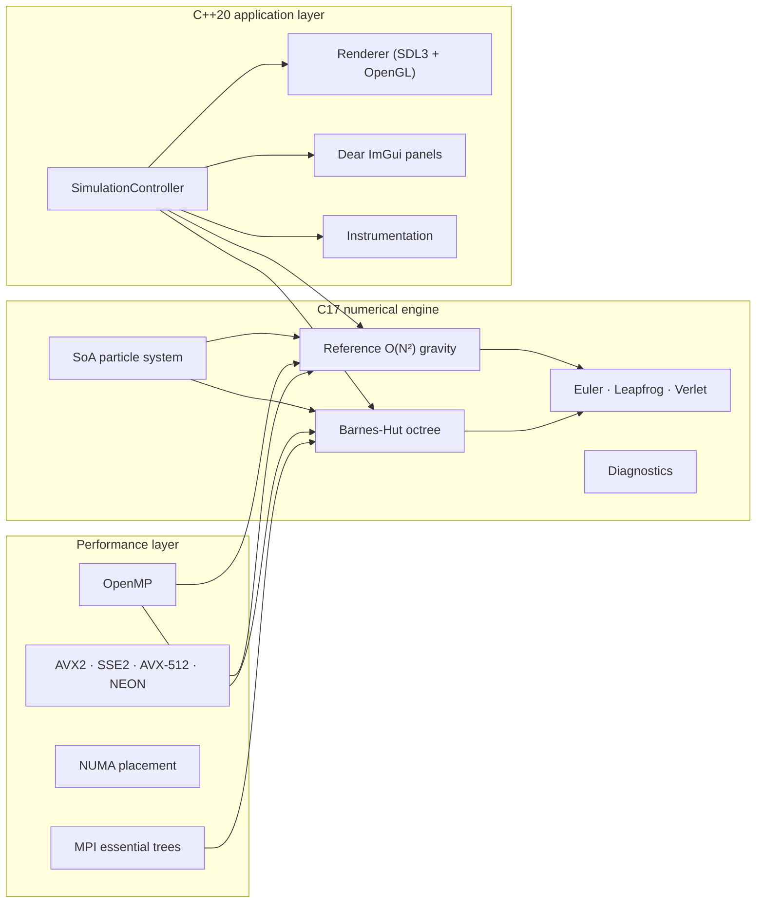

# N-Body Sim Pro

> A native **CPU** HPC simulation and visualization engine for large-scale
> gravitational N-body systems.

## What this is

N-Body Sim Pro is a serious, readable, CPU-only scientific computing engine: a
correctness-first reference implementation, progressively optimized with
OpenMP, runtime-dispatched SIMD, a Morton-order Barnes-Hut octree, NUMA-aware
placement, and MPI-distributed essential-tree execution —wrapped in a
technical SDL3/OpenGL/Dear ImGui workstation application and a headless,
benchmark-first CLI.

- **C17** for numerical kernels and low-level systems, **C++20** for the
  application, orchestration, and UI.
- **Physics is CPU-only.** OpenGL is used strictly for visualization.
- **Reference first.** A deliberately simple scalar O(N²) kernel is the
  correctness authority; every optimization is validated against it.
- **Measured, not claimed.** Every performance number in this site was
  actually measured on real hardware and is reproducible with the commands
  shown on the [Performance](/performance) page.

## Status sheet

| Component | Status | Notes |
|-----------|--------|-------|
| Reference O(N²) gravity | <svg viewBox="0 0 12 12" width="13" height="13" aria-hidden="true"><path d="M2 6.4 4.7 9.2 10 3.2" fill="none" stroke="currentColor" stroke-width="1.8" stroke-linecap="round" stroke-linejoin="round"/></svg>| scalar, double precision, single-threaded |
| Integrators | <svg viewBox="0 0 12 12" width="13" height="13" aria-hidden="true"><path d="M2 6.4 4.7 9.2 10 3.2" fill="none" stroke="currentColor" stroke-width="1.8" stroke-linecap="round" stroke-linejoin="round"/></svg>| Euler, leapfrog (kick-drift-kick), velocity Verlet |
| Two-body regression | <svg viewBox="0 0 12 12" width="13" height="13" aria-hidden="true"><path d="M2 6.4 4.7 9.2 10 3.2" fill="none" stroke="currentColor" stroke-width="1.8" stroke-linecap="round" stroke-linejoin="round"/></svg>| orbit, energy, momentum, COM over 8 orbits |
| Presets | <svg viewBox="0 0 12 12" width="13" height="13" aria-hidden="true"><path d="M2 6.4 4.7 9.2 10 3.2" fill="none" stroke="currentColor" stroke-width="1.8" stroke-linecap="round" stroke-linejoin="round"/></svg>| 9 astrophysical presets, deterministic seeds |
| OpenMP | <svg viewBox="0 0 12 12" width="13" height="13" aria-hidden="true"><path d="M2 6.4 4.7 9.2 10 3.2" fill="none" stroke="currentColor" stroke-width="1.8" stroke-linecap="round" stroke-linejoin="round"/></svg>| configurable threads, bit-identical all-pairs |
| SIMD dispatch | <svg viewBox="0 0 12 12" width="13" height="13" aria-hidden="true"><path d="M2 6.4 4.7 9.2 10 3.2" fill="none" stroke="currentColor" stroke-width="1.8" stroke-linecap="round" stroke-linejoin="round"/></svg>| scalar / SSE2 / AVX2 (+FMA) / AVX-512 / NEON detected |
| AVX2 all-pairs kernel | <svg viewBox="0 0 12 12" width="13" height="13" aria-hidden="true"><path d="M2 6.4 4.7 9.2 10 3.2" fill="none" stroke="currentColor" stroke-width="1.8" stroke-linecap="round" stroke-linejoin="round"/></svg>| 4.6× over scalar (measured) |
| SIMD Barnes-Hut | <svg viewBox="0 0 12 12" width="13" height="13" aria-hidden="true"><path d="M2 6.4 4.7 9.2 10 3.2" fill="none" stroke="currentColor" stroke-width="1.8" stroke-linecap="round" stroke-linejoin="round"/></svg>| implemented, validated; measured slower than scalar |
| Barnes-Hut octree | <svg viewBox="0 0 12 12" width="13" height="13" aria-hidden="true"><path d="M2 6.4 4.7 9.2 10 3.2" fill="none" stroke="currentColor" stroke-width="1.8" stroke-linecap="round" stroke-linejoin="round"/></svg>| contiguous nodes, Morton reorder, θ control |
| Allocation tracking | <svg viewBox="0 0 12 12" width="13" height="13" aria-hidden="true"><path d="M2 6.4 4.7 9.2 10 3.2" fill="none" stroke="currentColor" stroke-width="1.8" stroke-linecap="round" stroke-linejoin="round"/></svg>| thread-local buffered events |
| Structured logging | <svg viewBox="0 0 12 12" width="13" height="13" aria-hidden="true"><path d="M2 6.4 4.7 9.2 10 3.2" fill="none" stroke="currentColor" stroke-width="1.8" stroke-linecap="round" stroke-linejoin="round"/></svg>| levels, categories, developer console |
| Headless CLI + JSON | <svg viewBox="0 0 12 12" width="13" height="13" aria-hidden="true"><path d="M2 6.4 4.7 9.2 10 3.2" fill="none" stroke="currentColor" stroke-width="1.8" stroke-linecap="round" stroke-linejoin="round"/></svg>| `benchmark`, `hardware`, `save`, `resume` |
| Checkpointing | <svg viewBox="0 0 12 12" width="13" height="13" aria-hidden="true"><path d="M2 6.4 4.7 9.2 10 3.2" fill="none" stroke="currentColor" stroke-width="1.8" stroke-linecap="round" stroke-linejoin="round"/></svg>| versioned binary format, `save`/`resume` |
| NUMA | <svg viewBox="0 0 12 12" width="13" height="13" aria-hidden="true"><path d="M2 6.4 4.7 9.2 10 3.2" fill="none" stroke="currentColor" stroke-width="1.8" stroke-linecap="round" stroke-linejoin="round"/></svg>| detection, affinity, first-touch generation |
| MPI distributed | <svg viewBox="0 0 12 12" width="13" height="13" aria-hidden="true"><path d="M2 6.4 4.7 9.2 10 3.2" fill="none" stroke="currentColor" stroke-width="1.8" stroke-linecap="round" stroke-linejoin="round"/></svg>| essential-tree exchange, per-rank telemetry |
| 10M+ interactive | <svg viewBox="0 0 12 12" width="13" height="13" aria-hidden="true"><path d="M2 6.4 4.7 9.2 10 3.2" fill="none" stroke="currentColor" stroke-width="1.8" stroke-linecap="round" stroke-linejoin="round"/></svg>| 17.5 s/step on the reference laptop (16 threads) |
| AVX-512 / NEON kernels | <svg viewBox="0 0 12 12" width="13" height="13" aria-hidden="true"><path d="M6 2.2 10.6 9.8H1.4Z" fill="currentColor"/></svg>| detected; not yet implemented |
| GPU physics | <svg viewBox="0 0 12 12" width="13" height="13" aria-hidden="true"><path d="M2 6.4 4.7 9.2 10 3.2" fill="none" stroke="currentColor" stroke-width="1.8" stroke-linecap="round" stroke-linejoin="round"/></svg>| intentionally never |

## Headline measurements

Reproduced on an **Intel Core Ultra 7 255H** (16 threads, AVX2), Release build.
Full tables live in [Performance](/performance).

| Workload | Measured result |
|----------|-----------------|
| 16,384 particles, AVX2 vs scalar (1 thread) | **4.6×** |
| 16,384 particles, OpenMP+AVX2 (16 threads) | **26.9×** |
| 65,536 particles, Barnes-Hut vs scalar (1 thread) | **238×** |
| 1M particles, Barnes-Hut, 16 threads | **1.39 s / step** |
| 10M particles, Barnes-Hut, 16 threads | **17.5 s / step** |

## Documentation map

| Section | Covers |
|---------|--------|
| [Getting Started](/getting-started) | prerequisites, build, tests, launch |
| [Architecture](/architecture) | C/C++ boundary, particle storage, octree, dispatch |
| [Physics & Integrators](/physics) | gravity model, softening, integrators, presets |
| [Performance Overview](/performance) | measured results, scaling, θ trade-off |
| [OpenMP & Threading](/threading) | thread model, affinity, hot-loop rules |
| [SIMD](/simd) | coverage matrix, dispatch, AVX2 kernel |
| [NUMA-aware Placement](/numa) | detection, affinity, first-touch |
| [Distributed (MPI)](/distributed) | essential-tree exchange, correctness |
| [Instrumentation](/instrumentation) | logging, allocation tracking, telemetry |
| [CLI Reference](/cli) | every subcommand and option |

## The two hard rules

1. **Correctness before optimization.** The reference kernel stays forever.
   Optimized kernels are tested against it with defined tolerances.
2. **No fabricated telemetry.** Unavailable metrics render as `N/A`, not as
   placeholder numbers. If a kernel is slower, it is documented as slower.

Continue with [Getting Started](/getting-started) to build and run the
engine, or read the [Architecture](/architecture) and [Physics](/physics)
references.
