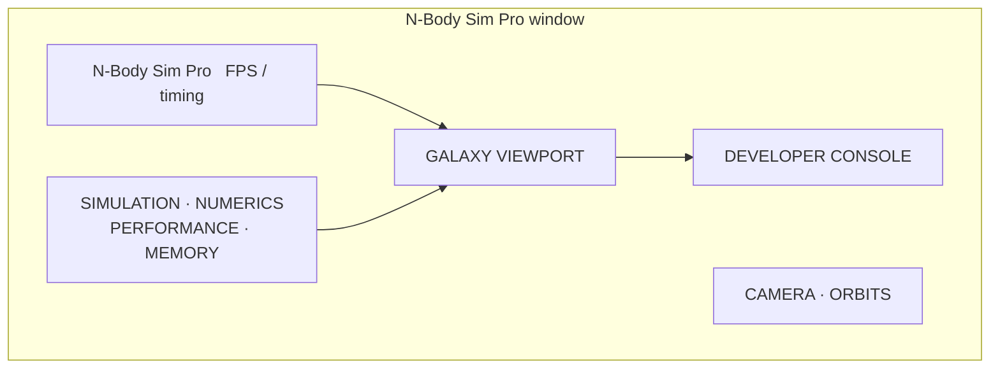

# Instrumentation

Every number in the UI and logs is **measured**. Nothing is fabricated; when
a metric cannot be measured, it renders as `N/A`.

## Structured logging

The logger (`src/cpp/logging/`) records events with a severity, a category, a
thread id, a timestamp, and a formatted message, into a bounded ring buffer
that the developer console renders. A console sink mirrors records at or
above a configurable threshold to stderr.

Levels (ordered): `OFF < ERROR < WARNING < INFO < DEBUG < TRACE <
PERFORMANCE < INSTRUMENTATION`.

Categories: simulation, threading, simd, tree, physics, memory, numerics,
render, application, system.

```text
[00000.001] [ INFO] [SIMD        ] [tid 8eb7] Selected SIMD backend: AVX2
[00000.065] [ INFO] [THREADING   ] [tid 8eb7] OpenMP available: yes
[00000.110] [ INFO] [SIMULATION  ] [tid 8eb7] Initialized preset two_body with 2 particles (seed 1)
[00000.162] [ INFO] [MEMORY      ] [tid 8eb7] Allocation tracking enabled (developer mode)
```

Logging is guarded by a severity check before any work, so disabled levels
are nearly free. **No logging calls exist in the numerical loops.**

## Allocation tracking

The allocator attaches a header carrying size, alignment, and a category to
every internal allocation. The allocation tracker (`allocation_tracker.c`)
records events into **thread-local staging buffers** and flushes them in
batches under one lock —the hot allocation path is a TLS store plus one
flag check. When disabled it is a single branch, so benchmark runs are not
invalidated by synchronous per-allocation logging.

Categories: `particle_storage`, `octree_nodes`, `thread_workspace`,
`temporary_buffer`, `checkpoint`, `renderer`, `ui`, `other`.

The memory panel shows live/peak bytes, live allocations, allocation and
deallocation rates, and a per-category breakdown —all from the tracker's
real counters.

## Phase telemetry

The Barnes-Hut kernel measures its own **tree build** and **force
evaluation** phases with internal timers; the controller measures the full
**step** time. The performance panel shows these real values.

```text
Step          : 25.571 ms
Tree build    : 3.121 ms
Force eval    : 22.104 ms
```

## Conservation diagnostics

Per step, the controller refreshes from the actual particle state:

- kinetic energy
- momentum error (relative to the initial momentum scale)
- center-of-mass displacement
- energy drift (throttled, only for ≤ 20,000 particles, because the
  potential sum is O(N²))

The numerics panel renders these live; for large systems energy drift shows
`N/A (N > 20000, O(N^2) potential)` —honest about why it is not computed.

## Developer console

The developer console (a Dear ImGui window) renders the logger's ring buffer
with level-colored records and an auto-scroll toggle and level filter. The
memory panel and performance/numerics panels are all driven by the same
measured state.

## UI layout

The application is laid out as a technical workstation, not a consumer
dashboard:



Simulation controls (preset, particles, seed, algorithm, θ, integrator,
timestep, thread count) live in the simulation panel; advanced internal
parameters stay out of the main panel.
