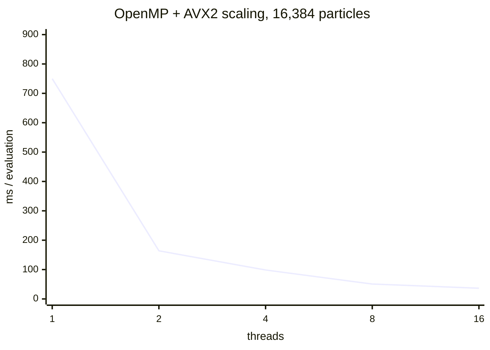

# Performance

Every number on this page was measured on the development machine — an
**Intel Core Ultra 7 255H** (16 logical threads, AVX2, no AVX-512), Windows,
MSYS2 GCC 16, Release build — and is reproducible with the commands shown.

## Methodology

- `benchmark` times a single **force evaluation** over `--steps` runs using a
  monotonic clock. It is headless; rendering is never involved.
- Thread scaling runs are sequential (each thread count timed separately),
  so there is no interference between them.
- Speedup and parallel efficiency are computed from the measured single
  thread baseline.
- Machine-readable JSON is printed as the final line for regression
  tracking.

Reproduce with:

```bash
n_body_sim_pro benchmark --particles 16384 --steps 3 --algorithm reference --threads 1
n_body_sim_pro benchmark --particles 16384 --steps 3 --algorithm avx2 --threads 1
n_body_sim_pro benchmark --particles 16384 --steps 3 --algorithm openmp_avx2 --threads 1,2,4,8,16
n_body_sim_pro benchmark --particles 1000000 --steps 3 --algorithm barnes_hut --threads 16
```

## All-pairs kernels (16,384 particles)

| Algorithm | threads | ms / evaluation | vs reference |
|-----------|---------|-----------------|--------------|
| reference (scalar) | 1 | 749.8 | 1.0× |
| avx2 | 1 | 163.9 | 4.6× |
| openmp_avx2 | 2 | 98.6 | 7.6× |
| openmp_avx2 | 4 | 50.7 | 14.8× |
| openmp_avx2 | 8 | 36.6 | 20.5× |
| openmp_avx2 | 16 | 27.9 | 26.9× |

**Observations:**

- SIMD alone (AVX2 vs reference at one thread) is a **4.6×** speedup.
- OpenMP+AVX2 efficiency is ~90% at 2–4 threads and drops at 8–16 threads.
  The kernel streams the entire position array for every particle, so it is
  **memory-bandwidth bound**, not compute bound. Linear scaling is not
  claimed.



## Barnes-Hut vs all-pairs (65,536 particles, 1 thread)

| Algorithm | ms / evaluation |
|-----------|-----------------|
| reference (scalar) | 11,523 |
| avx2 | 2,904 |
| barnes_hut (θ = 0.7) | 48.3 |

Barnes-Hut is **238×** faster than the scalar reference and **60×** faster
than AVX2 at this size, because all-pairs is O(N²) while Barnes-Hut is
O(N log N).

## Barnes-Hut scaling (16 threads, θ = 0.7)

| Particles | tree build | force eval | step |
|-----------|------------|------------|------|
| 16,384 | 9.4 ms | 58 ms | 64 ms |
| 1,000,000 | 543 ms | 765 ms | 1,388 ms |
| 10,000,000 | 7,399 ms | 8,907 ms | 17,503 ms |

The **Morton-order reordering** reduced the 1M step from **3.25 s** to
**1.39 s** (2.3×) with no change to the physics — the tree build and
traversal became cache-sequential.

## The θ trade-off

Measured on a 400-particle random cloud, RMS force error relative to the
exact all-pairs reference:

| θ | RMS error | total interaction work |
|---|-----------|------------------------|
| 0.1 | 1.4e-5 | 39,416 |
| 0.3 | 1.0e-3 | 32,591 |
| 0.7 | 1.5e-2 | 14,355 |

Lower θ is more accurate and more expensive; higher θ is cheaper and
coarser. The test suite asserts the monotonicity of this trade-off.

```mermaid
xychart-beta
    title "Accuracy vs cost across θ"
    x-axis "θ" [0.1, 0.3, 0.7]
    y-axis "log RMS error" -5 --> -1
    line [-4.85, -3.0, -1.82]
```

## SIMD Barnes-Hut (measured result)

A SIMD Barnes-Hut kernel is implemented and validated against the scalar
kernel to 1e-9 relative, but it is **not faster** on this hardware:

| N (1 thread) | scalar Barnes-Hut | SIMD Barnes-Hut |
|--------------|-------------------|-----------------|
| 65,536 | 68 ms | 300 ms |
| 262,144 | 234 ms | 1,643 ms |

The traversal is memory-latency bound: each particle walks ~30–60 tree nodes
with random access, and vectorizing the per-interaction arithmetic adds
staging overhead without removing the cache misses. The scalar kernel is the
default; the SIMD variant is documented honestly as an experiment that does
not win on this hardware.

## Distributed (MPI)

2 ranks, 4,096 particles per rank, θ = 0.7, MS-MPI on the same machine:

| Rank | particles | remote cells | essential | levels | compute | communication | step |
|------|-----------|--------------|-----------|--------|---------|---------------|------|
| 0 | 2,048 | 2,951 | 2,951 | 8 | 29.6% | 10.2% | 63.5 ms |
| 1 | 2,048 | 2,953 | 2,953 | 8 | 28.7% | 10.2% | 63.1 ms |

The distributed result matches the single-rank Barnes-Hut result within the
θ tolerance (validated by the `distributed_barnes_hut_test` under
`mpiexec`).

## Parallel generation

NUMA-aware parallel first-touch generation (1M particles, 16 threads):

| generator | time |
|-----------|------|
| sequential | 0.488 s |
| parallel (16 threads) | 0.433 s |

The primary benefit of the parallel path is NUMA page placement on
multi-socket systems; on the single-node reference machine the speedup is
modest (~12%).

## Honesty rules

- No number here is fabricated. Unavailable metrics render as `N/A`.
- AVX-512 and NEON kernels do not exist yet and are never benchmarked.
- The SIMD Barnes-Hut kernel is measurably slower than scalar on this
  hardware; that is documented, not hidden.
- Thread scaling reports measured efficiency, which drops as the kernel
  becomes memory-bound.
